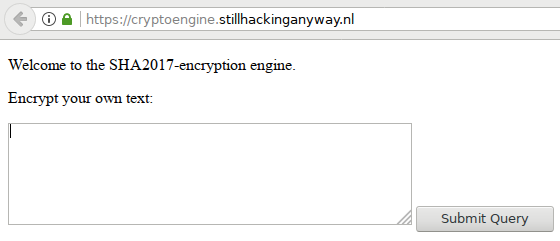
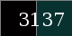

# SHA2017 CTF - Crypto Engine 200
The creators of the SHA2017 CTF "appetizer" built an own crypto algorithm which needed to be cracked to solve the challenge. This is a good example that building your own proprietary crypto algorithms is always not a good idea.

The fun thing about this crypto is, that the ciphertexts are encoded in pictures. An ["encryption engine"](https://cryptoengine.stillhackinganyway.nl/) (encrypting oracle) is given where text can be entered to generate the corresponding picture.

Additionally, the ciphertext of the flag is given:

## Finding out, how the ciphertext is encoded

A first look at the encrypted flag shows, that the ciphertext could be somehow encoded in a row of coloured blocks and an additional hexadecimal number printed in white on the right end of the row. A more detailed look reveals that each of these coloured blocks are 40 by 40 pixels in size. The generated png-image is only consisting of RGB data, with no alpha channel.

We know, that the flags always have this simple format: `flag{xxxxxxxxxxxxxxxxxxxxxxxxxxxxxxxx}`, where x stands for any hexadecimal character. So we first attempt to encrypt something of this format, like:
* `flag{0000`: 
* `flag{00000000000000000000000000000000}`: 
* and also play a bit around like `00000000`: 

What already is apparent, is that the first block always seems to be about the same tone of grey, when something starting with `flag` is supplied. Furthermore, supplying different-lengthed plaintext results also in different lengths of output images, which kind of makes sense as all information needs to be stored in the ciphertext.

Playing a bit around with the values, we find out, that every three characters, one block is added to the output image (three characters are the minimum which need to be supplied to generate an output image). If the number of characters is no divider of three, either one or two hexadecimal encoded bytes are shown on the right side of the image, depending on the rest of the division. If the number of characters modulo 3 is 1, two hex-characters (one byte) are shown, if it is 2, four hex-characters (two bytes) are shown. This alltogether probably means, that our data is encoded in the 24-bit RGB color code and is filled up with hex-printed bytes at the end instead of some padding to make the data divisable by 3. So we guess, that the encrypted data is shown as `RGBRGB...RGB` concatenated by `(1 or 2 hex bytes at the end)`.

Later, after finding out, how the encryption works, we'll see that this assumption is true. But in general, the data could've been also encoded differently. Just when playing around with the plaintext, we can be pretty sure, that every changed byte in the input changes at least the respective byte in the encoded data (and sometimes also further output bytes, but we still are mostly confident with that explanation).

For instance, the raw hex bytes of our flag make up as: `54 5c 50 50 2f 38 35 31 49 01 0d 02 2c 63 3e 36 49 57 06 03 2a 32 3f 67 18 53 59 01 28 32 3c 35 1c 54 04 00 2e 29`

## Finding out, how the cipher function works

We are lucky having an encrypting oracle given, which allows us to submit many plaintexts to the server which encrypts the data for us and returns the respective ciphertext. This ciphertext is encoded in pictures though, but we guessed a possible encoding scheme in the previous section, so we now can just get our ciphertext in (more easy to handle) hexadecimal data (all further hex-data is given simply in the sprintf-format `%02x`, seperated by spaces, i.e. without leading `0x`).

Playing around with different values submitted to the encryption generator shows us that even non-printable characters (like hex `00` or `01` for instance) are still used while encrypting the data. This can be done by just modifying the generator's "text" argument (the full URL is `https://cryptoengine.stillhackinganyway.nl/encrypt?text=` concatenated with the plaintext to be encrypted) and filling in HTTP-encoded bytes (like `%00%00%00...`). But first we only want to find out, how the first byte may be encrypted, as this could explain how the rest is done and always should be a good starting point. So we just change our first byte, and observe the changes in the output. As we need to submit at least three characters, we can do so, but just ignore the other two output bytes firstly. This leads us at least to (for now just look at the first output byte!):

* `%00__` encrypts as `32 6f 6e`
* `%01__` encrypts as `33 6f 6e`
* `%02__` encrypts as `30 6f 6e`
* `%03__` encrypts as `31 6f 6e`
* `%04__` encrypts as `36 6f 6e`
* `%05__` encrypts as `37 6f 6e`

(this sequence can be extended if needed, but basically this was already kind of enough for the trained eye to see what is going on here. If the next paragraph doesn't help you much, just generate all possible values from %00 to %7F, making up a longer list of encrypted values and optimize this as a logic function to see what it actually could be.)

Obviously the value in general counts up as we count up the input, but every second value, it jumps to a different value still nearby, but not quite in the series. Every fourth value, it jumps a bit further, but afterwards following the same scheme. Thinking about the simplest ciphers, which just consist of exclusive-or (XOR) functions, this reminds us of XORs. And seeing, that every second and every fourth value, some jump is existing, means, that a binary value ending with `...110` probably is XORed to the input value. Going further, we in fact find out, that XORing the value `0x32` is the only thing that happens with the first byte to be encrypted. This can be verified by testing numerous values, and also our flag, which we expect to start with an 'f', which luckily is the case: `54` (which the flag starts with) XOR `32` equals `66` which is an ASCII 'f'.

Now that we know how the first byte is encrypted we continue with the second byte, and firstly assume, that (in the dumbest case) it would be also encrypted with `32`. Testing that leads us that we are not correct without our assumption, but we are not far away, because the correct "key" value here would be `30`. Quickly we find out that encrypting `00 00 00 00 00 00 00 00...` should give us the full key, as an XOR with zero always results in the other input.

* `%00%00%00%00%00%00%00%00%00` encrypts as `32 30 31 37 32 30 31 37 32`

So if we are true now, the full (repeated) key reads `32 30 31 37` (funny, that is "2017" in ASCII, part of the CTF's name). Actually it is not as simple as that, because if supplying something else, we find out, that this 4-byte long key only holds for the first four byte. Afterwards somehow the key-state seems to be changed.
Just trying out, how it could've been changed, we could again play with some input values:

* `%01%00%00%00%00%00%00%00%00` encrypts as `33 30 31 37 33 30 31 37 33`
* `%01%01%01%01%00%00%00%00%00` encrypts as `33 31 30 36 33 31 30 36 33`
* `%02%02%02%02%00%00%00%00%00` encrypts as `30 32 33 35 30 32 33 35 30`
* `%01%02%03%04%01%02%03%04%00` encrypts as `33 32 32 33 32 30 31 37 32`

Especially the least result shows us, that we can be sure, what is going on here, as we get the first "state" in the second four values, if we encrypt twice the same 4-byte values following each other. What happens, is the internal state, which is XORed to our input bytes, is just set to the last encrypted data.

To make this more clear, we start with setting our state to our key: `32 30 31 37`. Encrypting our latest example `01 02 03 04` (XORing with the state) leads us to the cipher "block" `33 32 32 33`, and setting the state to the value of this cipher block. Going to the next block of four bytes, we again encrypt `01 02 03 04` (XORing with the state) and get `32 30 31 37`, and setting the state to this value. Finally we encrypt a single `00` (XORing with the state), thus getting the final trailing `32`, as `00` XOR `32` results in `32`. We hope, this is all clearly understandable so far. If not, one can feel free to open an issue.

Now we recovered the full cryptographic algorithm behind the given encryption engine. To sum up, we denote a pseudo-code of the encryption algorithm, given an plaintext sequence (P[0..N]) to be encrypted to the ciphertext (C[0..N]):

1. S := [`32 30 31 37`]
2. for I in 0..N:
	1. T := S[I mod 4] XOR P[I]
	2. C[I] := T
	3. S[I mod 4] := T
3. return C[0..N]

As the main logical function used in here is a single XOR, this function is directly inversible. Thus, the decryption function in this case equals exactly the encryption function, just that for decryption a ciphertext is supplied as input and the original plaintext is returned back.

# Bringing it all together

I wrote an exemplaric python script takes an "encrypted" image file (either local file or http(s) URL), asks for any text that can be seen on the displayed picture in a captcha-fashioned way, decrypts the decoded data, and finally returns the decrypted value as ASCII string. Using this crafted script, it is very easy to find out the actual flag value, which is finally `flag{deaf983eb34e485ce9d2aff0ae44f852}`.

One can find the source code of the python script [inside this GitHub-Repository](scripts/shadecrypt.py).

